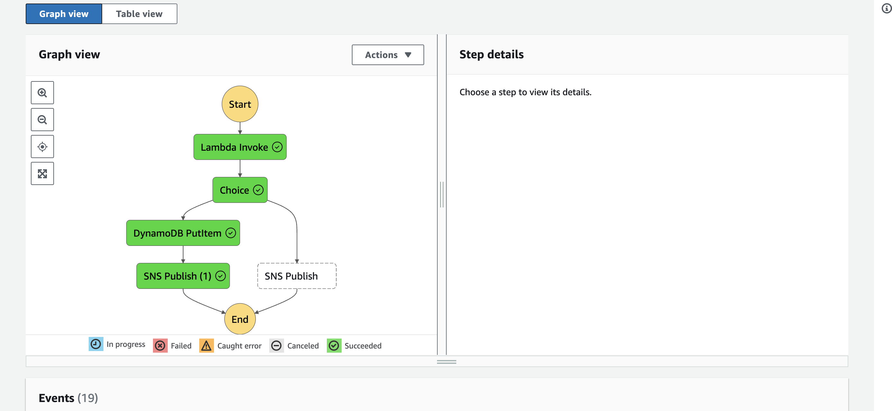

# Project 1 : Contact Form Workflow


## Building a Contactform Workflow
- SNS
- Lambda
- DynamoDB
- Add Error Handling


<hr>


### Input Payload
```json
{
  "name": "Gaurav",
  "phoneno": "98487"
}
```




